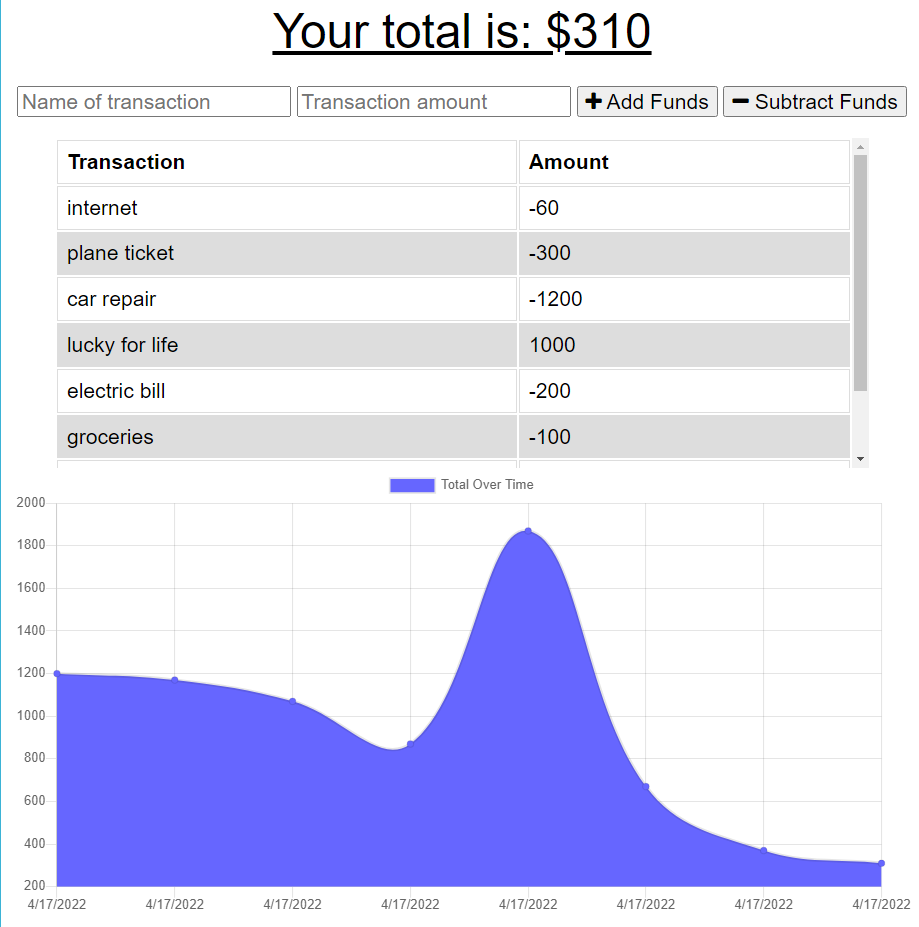

# Budget Tracker

# Purpose
Create a Progressive Web Application (PWA) that allows users to track their money in a fast and convenient way with offline functionality. 

# Acceptance Criteria
GIVEN a budget tracker without an internet connection  
WHEN the user inputs an expense or deposit  
THEN they will receive a notification that they have added an expense or deposit  
WHEN the user reestablishes an internet connection  
THEN the deposits or expenses added while they were offline are added to their transaction history and their totals are updated

# Installation
1. clone the repo
2. type "npm init --y" into your desired terminal
3. type "npm i" 
4. type "npm start"
5. open localhost 3001 :)

# Built With
- Express.js
- React.js
- MongoDB

# Screenshot

# Link to Live Application
https://powerful-springs-57936.herokuapp.com/ 
